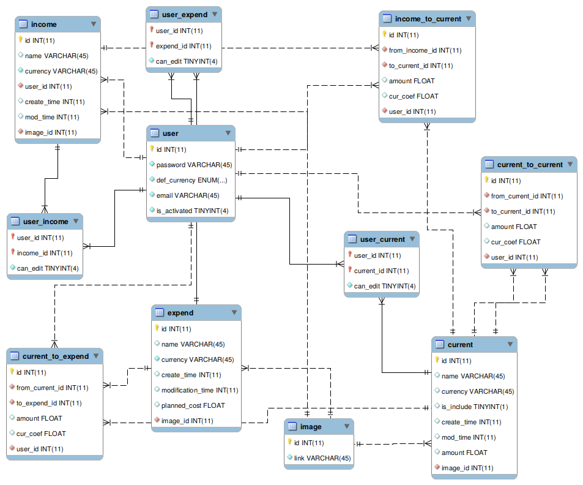

# moneta [](https://travis-ci.org/lv-386-python/moneta) [](https://coveralls.io/repos/github/lv-386-python/moneta/badge.svg?branch=dev)

## Description
Moneta is an application, that helps people to manage their finances. 
With "moneta" you can create different wallets 
and share them with other people, add purchases, incomes. 
Also, you can see the history of transactions and statistics.

## Technologies
* Python (3.7.0)
* MySQL (5.7)
* Django (2.1.7)
* Redis (4.0.9)

## Install
For the next steps of service installation, you will need setup of Ubuntu OS

### Install redis-server on your local machine:
```
sudo apt update
sudo apt install redis-server
```
[See this guide for more information:](https://www.digitalocean.com/community/tutorials/how-to-install-and-secure-redis-on-ubuntu-18-04)


### Install and configure MySQL server on your local machine:
```
sudo apt-get install mysql-server
mysql_secure_installation
sudo apt install python3-dev libmysqlclient-dev # debian / Ubuntu
```
[See this guide for more information:](https://www.digitalocean.com/community/tutorials/how-to-install-mysql-on-ubuntu-16-04)


### Install project
* Create a new virtual environment with `Python 3.7.0` (using `pyenv` or another tool).
* Clone this repository to your local machine
* Go to the cloned repository and install requirement project's packages
```
pip install -r requirements.txt
```

* Go to the `moneta/moneta/src/python/moneta/` 
(you should see `settings.py` file) 
project directory and create your own `local_settings.py` 
in the folder with settings.py and configure correct database connection.
```
DATABASES = {
    'default': {
        'ENGINE': 'django.db.backends.mysql',
        'OPTIONS': {
            'read_default_file': '/etc/mysql/moneta.cnf',
        },
    }
}
```

### Setup database locally
* Open file `/etc/mysql/moneta.cnf` with following command: 
```
sudo nano /etc/mysql/moneta.cnf
```
* Add following options to this file
```
[client]
database = db_moneta
user = moneta_user
password = db_password
default-character-set = utf8
```

* Create a Database and Database User
```
mysql -u root -p
mysql> CREATE DATABASE db_moneta CHARACTER SET UTF8;
mysql> CREATE USER moneta_user@localhost IDENTIFIED BY 'db_password';
mysql> GRANT ALL PRIVILEGES on db_moneta.* TO moneta_user@localhost;
mysql> FLUSH PRIVILEGES;
mysql> exit
```

* Use a Database
```
Change directory to ~/moneta/moneta/db/moneta/
sudo mysql -u moneta_user -p
mysql> use db_moneta;
mysql> SOURCE CREATE_DB.sql;
mysql> SOURCE INSERT_DB.sql;
```
Existing user for authentification
```
email: shotatam@gmail.com
password: shotatam
```
### Database scheme



### Django
* Go to the folder with `manage.py` file and run migrate files
```
python manage.py migrate
```

* Go to the folder with `manage.py` file, run django server 
```
python manage.py runserver
```

# Developer info:

### Lv-386.WebUI/Python team:

- @lhalam - Liubomyr Halamaha - teacher
- @alutsysh - Lutsyshyn Andrii - expert
- @Andriy97091
- @irynazaiets
- @jelysaw
- @MaksymGromyk
- @shado1997
- @tavor118
- @VolodymyrBodnar
- @wm139